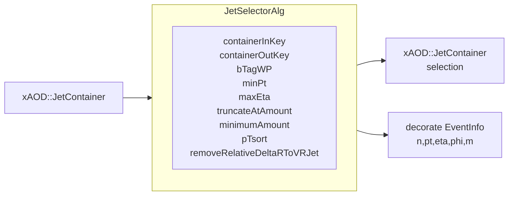
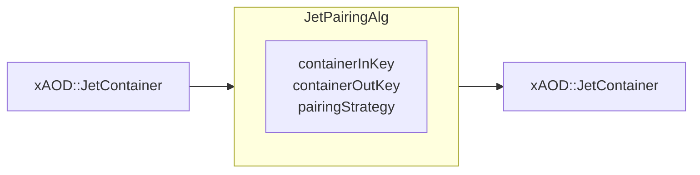
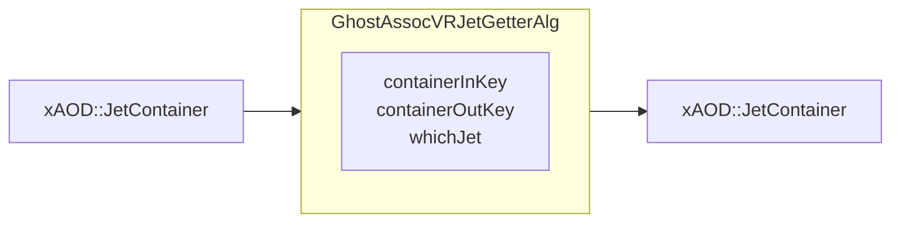
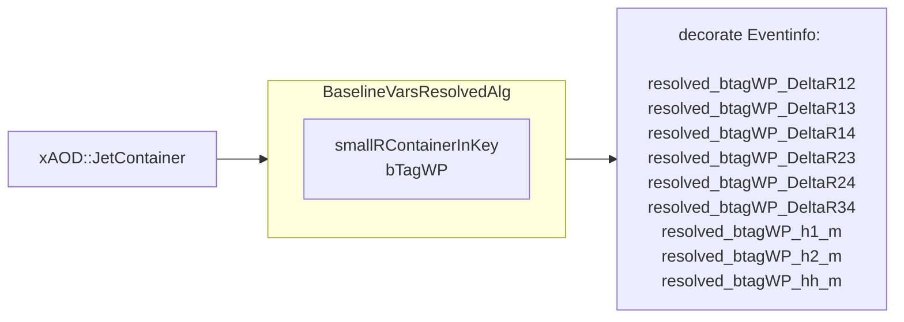
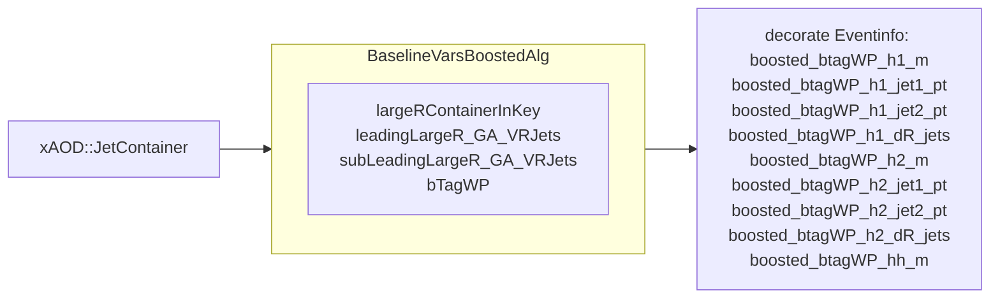

# Algorithms configurable from `easyjet-ntupler`

All the algorithms described here can be configured from python with the `ComponentAccumulator`  and are intended to have an interface to JetContainers from python:

```python
# you need a ComponentAccumulator object somewhere
cfg = ComponentAccumulator()
    # add SomeAlgorithm to the ComponentAccumulator
    cfg.addEventAlgo(
        CompFactory.HH4B.SomeAlgorithm(
            "MyAlgorithmName" # needs to be unique! 
            options
            ...
        )
    )
```

The first entry needs to be unique, so athena knows which algorithm to run. Algorithms described with a `containerInKey` option, take a `xAOD::JetContainer`, do some operations with these jets and write another `xAOD::JetContainer` object holding the jets of interest to the StoreGate (the interface to load/write xAOD objects) with the name `containerOutKey`. The output container is written in `VIEW_ELEMENTS` mode, meaning that that the jets of interest are pointers to the jets from the input container, so that existing info is referenced and not duplicated in memory. All implementations can be found in [HH4bAnalysis/src/](https://gitlab.cern.ch/easyjet/hh4b-analysis/-/tree/master/HH4bAnalysis/src). Examples of these algorithms in place can be found in [docs/DiHiggsChain.md](https://gitlab.cern.ch/easyjet/hh4b-analysis/-/tree/master/docs/DiHiggsChain.md).
&nbsp;
&nbsp;

#### JetSelectorAlg




This selects Jets and writes them as a ViewContainer to the StoreGate. This algorithms is fast so feel free to even stack it after one another, if you want to construct any funny selection. It also decorates the four vector info to the EventInfo object and the nr of jets that passed the selection (disregarding `truncateAtAmount` and minimumAmount). As you can disable all selections it can also be considered a sheer four vector writer of any `xAOD::JetContainer`. So you can add branches to the tree like
```
TreeBranches += [
            "EventInfo.MyContainer_pt   ->  MyContainer_pt"
            "EventInfo.MyContainer_eta   ->  MyContainer_eta"
            "EventInfo.MyContainer_phi   ->  MyContainer_phi"
            "EventInfo.MyContainer_m"   ->  MyContainer_m"
            "EventInfo.MyContainer_n"   ->  MyContainer_n" # nr of selected jets
            ]

```

| option                      | type   | example                   | meaning                                                                                                                                                                        |
| --------------------------- | ------ | ------------------------- | ------------------------------------------------------------------------------------------------------------------------------------------------------------------------------ |
| containerInKey              | string | "AntiKt4EMPFlowJets"      | xAOD::JetContainer name                                                                                                                                                        |
| containerOutKey             | string | "MyContainer"             | xAOD::JetContainer name                                                                                                                                                        |
| bTagWP                      | string | "DL1dv00_FixedCutBEff_77" | select jets with a btagging working point. Ignore with empty string ``                                                                                                         |
| minPt                       | float  | 20_000                    | minimum pt                                                                                                                                                                     |
| maxEta                      | float  | 2.0                       | maximum eta                                                                                                                                                                    |
| minimumAmount               | int    | 4                         | minimum amount of the output jets you require. It can be ignored with `-1`. It will return an empty container if the condition is not fulfilled                                |
| truncateAtAmount            | int    | 4                         | truncates the nr of jets to the given value. This also optimizes the sorting. It can be ignored with `-1`. It will return an empty container if the condition is not fulfilled |
| pTsort                      | bool   | true                      | Wether to sort the jets by pt                                                                                                                                                  |
| removeRelativeDeltaRToVRJet | bool   | false   (per default)     | This is to remove VR jets that overlap within a large R jet. If this is the case it will return an empty jet container                                                         |


&nbsp;
&nbsp;
#### JetPairingAlg


This is currently intended for a Dihiggs analysis. It assumes to get a pt sorted JetContainer and returns the pairing of the leading (h1) and subleading (h2) Higgs candidates as four jets in the order:
- h1_leading_pt_jet
- h1_subleading_pt_jet
- h2_leading_pt_jet
- h2_subleading_pt_jet

| option          | type   | example        | meaning                                                                                                                                                                                                   |
| --------------- | ------ | -------------- | --------------------------------------------------------------------------------------------------------------------------------------------------------------------------------------------------------- |
| containerInKey  | string | "MyContainer"  | xAOD::JetContainer name                                                                                                                                                                                   |
| containerOutKey | string | "MyPairedJets" | xAOD::JetContainer name                                                                                                                                                                                   |
| pairingStrategy | string | "minDeltaR"    | Strategy to do the pairing, currently only `minDeltaR` which constructs the leading Higgs candidate for the closest one the the leading pt jet and the subleading Higgs Candidate from the two leftovers. |

&nbsp;
&nbsp;
#### GhostAssocVRJetGetterAlg


Variable radius (VR) jets are written onto the parent (untrimmed) large R jets as 
`std::vector<ElementLink<xAOD::IParticleContainer>>`. This serves as a Getter and Converter for them to a `xAOD::JetContainer` for further processing with other algorithms, e.g. select on btagging, sorting, decorating etc. 


| option          | type   | example      | meaning                                                                                                                                                                                             |
| --------------- | ------ | ------------ | --------------------------------------------------------------------------------------------------------------------------------------------------------------------------------------------------- |
| containerInKey  | string | "LargeRJets" | xAOD::JetContainer name                                                                                                                                                                             |
| containerOutKey | string | "MyVRJets"   | xAOD::JetContainer name                                                                                                                                                                             |
| whichJet        | int    | 0            | Index of the inContainer starting at `0`. If you e.g. want the VR jets from the leading Large R, you would use the `JetSelectorAlg` to return you a pt sorted JetContainer and use whichJet to `0`. |

&nbsp;
&nbsp;
#### BaselineVarsResolvedAlg



Calculate variables for the paired small R jets for a given btagging working point and decorates them to the EventInfo. Note that it Assumes the order from the JetPairingAlg. If the algorithm does not get a jetContainer with at least 4 jets it decorates all variables with default values of `-1`.

| option               | type   | example                   | meaning                                               |
| -------------------- | ------ | ------------------------- | ----------------------------------------------------- |
| smallRcontainerInKey | string | "MyPairedJets"            | xAOD::JetContainer name                               |
| bTagWP               | string | "DL1dv00_FixedCutBEff_77" | btagging working point (needed for unique decoration) |

Decorations per working point in the format `EventInfo.resolved_{variable}_{bTagWP}`:
| variable | meaning                                                        |
| -------- | -------------------------------------------------------------- |
| DeltaR12 | delta R between jets from the pairing order, cf. JetPairingAlg |
| DeltaR13 | delta R between jets from the pairing order, cf. JetPairingAlg |
| DeltaR14 | delta R between jets from the pairing order, cf. JetPairingAlg |
| DeltaR23 | delta R between jets from the pairing order, cf. JetPairingAlg |
| DeltaR24 | delta R between jets from the pairing order, cf. JetPairingAlg |
| DeltaR34 | delta R between jets from the pairing order, cf. JetPairingAlg |
| h1_m     | invariant mass of leading higgs candidate                      |
| h2_m     | invariant mass of subleading higgs candidate                   |
| hh_m     | invariant mass of Dihiggs                                      |

&nbsp;
&nbsp;
#### BaselineVarsBoostedAlg

Calculate variables for the boosted regime and decorate eventInfo per btagging working point. Assumes to get a pt sorted Large R container. The btagging will be select with the `JetSelectorAlg` that you handed the VR Jets you got from `GhostAssocVRJetGetterAlg`. The algorithm decorates defaults `-1` if none of the handed jetContainers contain >=2 jets.

| option                     | type   | example                        | meaning                                                                          |
| -------------------------- | ------ | ------------------------------ | -------------------------------------------------------------------------------- |
| largeRContainerInKey       | string | "MyPtSortedLargeRJets"         | xAOD::JetContainer name                                                          |
| leadingLargeR_GA_VRJets    | string | "MyVRJetsFromLeadingLargeR"    | xAOD::JetContainer name, you retrieved these with the `GhostAssocVRJetGetterAlg` |
| subLeadingLargeR_GA_VRJets | string | "MyVRJetsFromSubLeadingLargeR" | xAOD::JetContainer name, you retrieved these with the `GhostAssocVRJetGetterAlg` |
| bTagWP                     | string | "DL1r_FixedCutBEff_77"         | btagging working point (needed for unique decoration)                            |


Decorations per working point in the format `EventInfo.boosted_{variable}_{bTagWP}`:
| variable   | meaning                                      |
| ---------- | -------------------------------------------- |
| h1_m       | invariant mass of leading higgs candidate    |
| h1_jet1_pt | pt of leading VR track jet in h1             |
| h1_jet2_pt | pt of subleading VR track jet in h1          |
| h1_dR_jets | delta R of the two leading btagging VR jets  |
| h2_m       | invariant mass of subleading higgs candidate |
| h2_jet1_pt | pt of leading VR track jet in h2             |
| h2_jet2_pt | pt of subleading VR track jet in h2          |
| h2_dR_jets | delta R of the two leading btagging VR jets  |
| hh_m       | invariant mass of Dihiggs                    |


&nbsp;
&nbsp;
